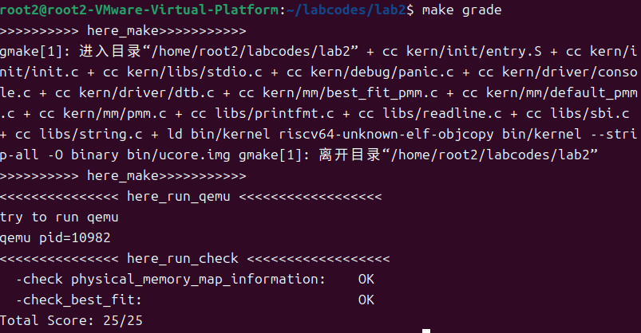

## 练习1：理解first-fit 连续物理内存分配算法（思考题）
### 实验要求
first-fit 连续物理内存分配算法作为物理内存分配一个很基础的方法，需要同学们理解它的实现过程。请大家仔细阅读实验手册的教程并结合kern/mm/default_pmm.c中的相关代码，认真分析default_init，default_init_memmap，default_alloc_pages， default_free_pages等相关函数，并描述程序在进行物理内存分配的过程以及各个函数的作用。 请在实验报告中简要说明你的设计实现过程。请回答如下问题：

- 你的first fit算法是否有进一步的改进空间？

### 实现原理
First-Fit算法的核心思想是维护一个空闲内存块列表。当需要分配内存时，从列表头开始顺序查找，找到第一个大小足够满足请求的空闲块就立即分配。如果该块比需要的大，就把剩余部分作为新空闲块放回列表。

### 各个函数的作用分析
本次实验中，我们需要分析4个函数：
```c
static void default_init(void) {
    list_init(&free_list);
    nr_free = 0;
}
```
作用：初始化空闲内存块链表和空闲页面计数器，为后续内存管理做准备。

```c
 static void default_init_memmap(struct Page *base, size_t n)
```
作用：初始化一个连续的空闲内存区域；设置每个页面的标志位并将第一个页面的property字段设置为整个空闲块的大小，按地址升序把空闲块插入到空闲链表中。


```c
static struct Page *default_alloc_pages(size_t n)
```
作用：遍历空闲链表，使用首次适应算法找到第一个大小>=n的空闲块，如果找到的块大于需求则分割剩余部分并重新加入链表；更新空闲页面计数器；返回分配的内存块首地址。


```c
    static void default_free_pages(struct Page *base, size_t n)
```
作用：释放已分配的页面并重置其页面属性；按地址升序将释放的块插入空闲链表；合并前后相邻的空闲块以减少内存碎片。

### 物理内存分配过程
#### 系统初始化
- 调用default_init初始化管理数据结构
- 通过default_init_memmap建立初始的空闲内存块
#### 内存分配
- 应用程序请求分配n个连续页面
- default_alloc_pages遍历空闲链表，找到第一个合适的块
- 如果块大小匹配，直接分配；如果更大，进行分割
- 更新管理信息，返回分配结果
#### 内存释放
- 调用default_free_pages释放指定页面
- 将释放的块按地址顺序插入链表
- 检查前后相邻块是否空闲，进行合并操作
### 改进空间
数据结构优化、碎片管理优化。
### 重要知识点对比
| 实验中的知识点 | OS原理中的对应知识点 | 含义说明 | 关系与差异 |
|---------------|---------------------|----------|-----------|
| 首次适应(First-Fit)算法 | 连续内存分配算法 | 实验：遍历空闲链表找第一个满足大小的块<br>原理：动态分区分配基本策略 | 关系：实验实现原理算法<br>差异：实际OS结合多种算法 |
| 空闲链表管理 | 动态分区分配数据结构 | 实验：双向链表管理空闲块<br>原理：多种管理方法 | 关系：都用于跟踪空闲区域<br>差异：原理涵盖更多数据结构 |
| 页面分割与合并 | 内存碎片处理 | 实验：分配分割、释放合并<br>原理：外部碎片解决方法 | 关系：实验展示具体技术<br>差异：原理讨论更复杂方法 |
| 物理内存初始化 | 启动时内存探测 | 实验：建立初始空闲块<br>原理：BIOS到OS的转换 | 关系：都是启动阶段准备<br>差异：实验简化硬件复杂性 |


## 练习2：实现 Best-Fit 连续物理内存分配算法（需要编程）
### 实验要求
在完成练习一后，参考kern/mm/default_pmm.c对First Fit算法的实现，编程实现Best Fit页面分配算法，算法的时空复杂度不做要求，能通过测试即可。 请在实验报告中简要说明你的设计实现过程，阐述代码是如何对物理内存进行分配和释放，并回答如下问题：

- 你的 Best-Fit 算法是否有进一步的改进空间？

### 实现原理
Best-Fit算法的核心思想是每次分配内存时，选择最小的能够满足请求的空闲块，从而减少内存碎片。
而我们的实验是按内存地址排序的链表，并通过完整遍历来找到最佳块。简单来说就是，遍历寻找满足要求的块，在满足要求的块中选择最小的块进行分配。

### 实验过程
本次实验中，我们需要填写5个代码块，可以参考first fit算法的实现，来补充代码，代码分别是：
```c
for (; p != base + n; p ++) {
        assert(PageReserved(p));
        p->flags = 0; 
        set_page_ref(p, 0); 
        ClearPageProperty(p); 
    }
```
这段代码是将一段连续的页框（从base开始，共n个）初始化为未保留状态，并清除它们的标志和属性信息，同时将引用计数设置为0。

```c
 while ((le = list_next(le)) != &free_list) {
            struct Page* page = le2page(le, page_link);
            if (base < page) {
                list_add_before(le, &(base->page_link)); 
                break; 
            } else if (list_next(le) == &free_list) {
                list_add(le, &(base->page_link)); 
            }

        }
```
这段代码是将一个空闲内存块（base）按地址顺序插入到空闲链表中，保持链表的地址有序性。


```c
while ((le = list_next(le)) != &free_list) {
        struct Page *p = le2page(le, page_link);
        if (p->property >= n) {
            if (p->property < min_size) {
                page = p;
                min_size = p->property; 
        }
    }
```
这段代码是遍历空闲链表，寻找最小的能够满足请求的空闲块（即property >= n且property最小的块），并将其赋值给page变量。


```c
    base->property = n; 
    SetPageProperty(base);
    nr_free += n;
```
这段代码是将一个页块（base）标记为包含n个连续页框的空闲块，并更新系统中空闲页框的总数。

```c
list_entry_t* le = list_prev(&(base->page_link));
    if (le != &free_list) {
        p = le2page(le, page_link);
        if (p + p->property == base) {
            p->property += base->property; 
            ClearPageProperty(base); 
            list_del(&(base->page_link)); 
            base = p; 
        }
    }
```
这段代码是检查并合并当前释放的页块（base）与其前面的空闲页块（p），如果它们是连续的，则将它们合并为一个更大的空闲块，并更新链表和属性信息。

我们还需要对pmm.c中的代码进行修改：
```c
static void init_pmm_manager(void) {
    pmm_manager = &best_fit_pmm_manager;
    cprintf("memory management: %s\n", pmm_manager->name);
    pmm_manager->init();
}
```
这段代码是初始化物理内存管理器，将当前的内存管理器设置为Best-Fit算法的实现，并调用其初始化函数。
我们在lab2文件夹中通过终端，输入指令：
```bash
make grade
```
来对代码进行编译和测试，测试通过后，说明代码实现正确。
以下是测试通过的截图：


## Challenge1：buddy system(伙伴系统)分配算法(需要编程)
### 实验要求
Buddy System算法把系统中的可用存储空间划分为存储块(Block)来进行管理, 每个存储块的大小必须是2的n次幂(Pow(2, n)), 即1, 2, 4, 8, 16, 32, 64, 128...等。每次分配内存时，系统会选择一个最小的能够满足请求的存储块，如果没有合适大小的存储块，则从更大的存储块中拆分出一个合适大小的存储块进行分配。释放内存时，如果相邻的存储块都是空闲的，则将它们合并为一个更大的存储块。

### 实现原理
Buddy System算法通过将内存划分为2的n次幂大小的块来管理内存，从而减少内存碎片。每次分配内存时，系统会选择一个最小的能够满足请求的块，如果没有合适大小的块，则从更大的块中拆分出一个合适大小的块进行分配。释放内存时，如果相邻的块都是空闲的，则将它们合并为一个更大的块。

### 具体实现

#### 数据结构设计
我们设计了如下的数据结构来实现Buddy System算法：

```c
struct buddy2 {
  unsigned size;// 管理内存的总单元数目
  unsigned longest[1];// 每个节点记录该节点所管理的内存块中最大空闲块的大小   
};

typedef struct{
    Page* base; // buddy system内存池的起始地址
    buddy2* root; // buddy system内存池的管理结构
    unsigned int nr_free; // 空闲页数
    unsigned int total_size; // 总页数
} buddy_system_t;
```

#### 初始化
初始化buddy_system结构体的各个字段，buddy2结构体的longest数组，构建二叉树，会将管理的内存块数量调整为小于等于n的最大2的幂次方

```c
static void
buddy_system_init_memmap(struct Page *base, size_t n)
{
    //cprintf("Buddy System Physical Memory Manager Memmap Init Start\n");
    assert(n > 0);
    struct Page *p = base;
    for (; p != base + n; p++)
    {
        assert(PageReserved(p));
        p->flags = p->property = 0;
        set_page_ref(p, 0);
    }

    buddy_base = base;
    buddy_total_size = n;
    //cprintf("buddy_total_size: %u\n", buddy_total_size);
    unsigned int size = alt_fixsize(n);
    //cprintf("size: %u\n", size);
    buddy_nr_free = size;
    //cprintf("buddy_nr_free: %u\n", buddy_nr_free);
    unsigned int len = size * 2 - 1;
    buddy_root = (buddy2 *)KADDR(page2pa(base)); // buddy2结构紧跟在Page数组后面
    buddy_root->size = size;
    /*
    初始化buddy2结构
    由于n可能不是2的幂次方，因此需要将管理的单元数目减少为小于等于n的最小2的幂次方
    longest数组的长度为2*size-1,前size-1个元素用于存储非叶子节点的信息，后size个元素用于存储叶子节点的信息
    */
    for (unsigned int i = 0; i < len; i++)
    {
        buddy_root->longest[i] = 1;
    }
    for (int i = size - 2; i >= 0; i--)
    {
        buddy_root->longest[i] = buddy_root->longest[LEFT_LEAF(i)] * 2;
    }

    //cprintf("w\n%u\n", buddy_root->longest[32767]);
    //cprintf("w\n%u\n", buddy_root->longest[0]);
    //cprintf("w\n%u\n", buddy_root->longest[1]);
    //cprintf("w\n%u\n", buddy_root->longest[2]);
    buddy_base->property = size;
    SetPageProperty(buddy_base);
    //cprintf("Buddy System Physical Memory Manager Memmap Init OK\n");
}
```

#### 分配内存
首先根据请求的内存大小调整为2的幂次方，并且判断是否有足够的空闲页，如果没有则返回NULL，然后进行适配搜索，深度优先遍历，当找到对应节点后，将其longest标记为0，即分离适配的块出来，并转换为内存块索引offset，之后获取到page指针，更新nr_free字段，并且沿着路径更新longest数组

```c
static struct Page *
buddy_system_alloc_pages(size_t n)
{
    //cprintf("Buddy System Physical Memory Manager Alloc Start\n");
    unsigned int index = 0;
    unsigned int node_size;
    unsigned int offset = 0;
    struct Page *page = NULL;
    assert(n > 0);
    if (n > buddy_nr_free)
    {
        return NULL;
    }
    if (!IS_POWER_OF_2(n))
    {
        n = fixsize(n);
    }

    if (buddy_root->longest[index] < n)
    {
        return NULL;
    }

    for(node_size = buddy_root->size; node_size != n; node_size /= 2)
    {
        if(buddy_root->longest[LEFT_LEAF(index)] >= n)
            index = LEFT_LEAF(index);
        else
            index = RIGHT_LEAF(index);
    }

    buddy_root->longest[index] = 0;
    offset = (index + 1) * node_size - buddy_root->size;
    cprintf("index:%u\n", index);
    cprintf("offset:%u\n", offset);

    page = buddy_base + offset;
    page->property = 0;
    ClearPageProperty(page);
    buddy_nr_free -= n;
    if( index%2==1 && buddy_root->longest[index+1]==node_size) 
        {
            struct Page* right = buddy_base + offset + node_size;
            right->property = node_size;
            SetPageProperty(right);            
        }

    while(index)
    {
        index = PARENT(index);
        node_size *= 2;
        offset = (index + 1) * node_size - buddy_root->size;
        buddy_root->longest[index] = MAX(buddy_root->longest[LEFT_LEAF(index)], buddy_root->longest[RIGHT_LEAF(index)]);
        if( index%2==1 && buddy_root->longest[index+1]==node_size) 
        {
            struct Page* right = buddy_base + offset + node_size;
            right->property = node_size;
            SetPageProperty(right);            
        }
    }
   
    //cprintf("Buddy System Physical Memory Manager Alloc OK\n");
    return page;
}
```

#### 释放内存
同样首先根据释放的页数n，调整为大于等于n的最小2的幂次方，若页面不是保留的，也不是空闲块的第一个页面，则将其置为空闲状态，之后计算释放的内存块在二叉树中的位置，更新longest数组，标记释放的内存块为可用，并尝试合并相邻的空闲块

```c
static void
buddy_system_free_pages(struct Page *base, size_t n)
{
    //cprintf("Buddy System Physical Memory Manager Free Start\n");
    unsigned int index = 0;
    unsigned int node_size = n;
    unsigned int offset = 0;
    struct Page *p = base;

    assert(n > 0);
    if (!IS_POWER_OF_2(n))
    {
        n = fixsize(n);
        node_size = n;
    }
    for (; p != base + n; p++)
    {
        assert(!PageReserved(p) && !PageProperty(p));
        p->flags = 0;
        set_page_ref(p, 0);
    }
    base->property = n;
    SetPageProperty(base);
    buddy_nr_free += n;

    offset = base - buddy_base;
    index = (offset + buddy_root->size) / n - 1;

    buddy_root->longest[index] = n;
    while (index)
    {
        index = PARENT(index);
        if(buddy_root->longest[LEFT_LEAF(index)] == buddy_root->longest[RIGHT_LEAF(index)] && buddy_root->longest[LEFT_LEAF(index)] == node_size)
            {
                buddy_root->longest[index] = buddy_root->longest[LEFT_LEAF(index)] * 2;
                offset = (index + 1) * node_size * 2 - buddy_root->size;
                struct Page* LPage = buddy_base + offset;
                struct Page* RPage = LPage + node_size;
                LPage->property = node_size * 2;
                SetPageProperty(LPage);
                ClearPageProperty(RPage);
            }
        else
            buddy_root->longest[index] = MAX(buddy_root->longest[LEFT_LEAF(index)], buddy_root->longest[RIGHT_LEAF(index)]);
        node_size *= 2;
    }
    //cprintf("Buddy System Physical Memory Manager Free OK\n");
}
```

### 测试

首先输出未分配内存状态下的空闲块信息，如下所示：
```
Buddy System Tree Structure:
Node 0: longest = 16384, 地址为: 0xffffffffc020f318
```
此时，表示整个内存块都是空闲的，大小为16384页。

接下来，分别分配10页和20页内存，并输出分配后的空闲块信息，如下所示：
```
index:1023
offset:0
Allocated 10 pages at 0xffffffffc020f318
Buddy System Tree Structure:
Node 2: longest = 8192, 地址为: 0xffffffffc025f318
Node 4: longest = 4096, 地址为: 0xffffffffc0237318
Node 8: longest = 2048, 地址为: 0xffffffffc0223318
Node 16: longest = 1024, 地址为: 0xffffffffc0219318
Node 32: longest = 512, 地址为: 0xffffffffc0214318
Node 64: longest = 256, 地址为: 0xffffffffc0211b18
Node 128: longest = 128, 地址为: 0xffffffffc0210718
Node 256: longest = 64, 地址为: 0xffffffffc020fd18
Node 512: longest = 32, 地址为: 0xffffffffc020f818
Node 1024: longest = 16, 地址为: 0xffffffffc020f598

index:512
offset:32
Allocated 20 pages at 0xffffffffc020f818
Buddy System Tree Structure:
Node 2: longest = 8192, 地址为: 0xffffffffc025f318
Node 4: longest = 4096, 地址为: 0xffffffffc0237318
Node 8: longest = 2048, 地址为: 0xffffffffc0223318
Node 16: longest = 1024, 地址为: 0xffffffffc0219318
Node 32: longest = 512, 地址为: 0xffffffffc0214318
Node 64: longest = 256, 地址为: 0xffffffffc0211b18
Node 128: longest = 128, 地址为: 0xffffffffc0210718
Node 256: longest = 64, 地址为: 0xffffffffc020fd18
Node 1024: longest = 16, 地址为: 0xffffffffc020f598
```
可以看出，p1分配到了起始地址为0xffffffffc020f318的16页内存，p2分配到了起始地址为0xffffffffc020f818的32页内存。

然后，释放p1所分配的内存，再分配5页内存，并输出的空闲块信息，如下所示：
```
Freed 10 pages at 0xffffffffc020f318
Buddy System Tree Structure:
Node 2: longest = 8192, 地址为: 0xffffffffc025f318
Node 4: longest = 4096, 地址为: 0xffffffffc0237318
Node 8: longest = 2048, 地址为: 0xffffffffc0223318
Node 16: longest = 1024, 地址为: 0xffffffffc0219318
Node 32: longest = 512, 地址为: 0xffffffffc0214318
Node 64: longest = 256, 地址为: 0xffffffffc0211b18
Node 128: longest = 128, 地址为: 0xffffffffc0210718
Node 256: longest = 64, 地址为: 0xffffffffc020fd18
Node 511: longest = 32, 地址为: 0xffffffffc020f318

index:2047
offset:0
Allocated 5 pages at 0xffffffffc020f318
Buddy System Tree Structure:
Node 2: longest = 8192, 地址为: 0xffffffffc025f318
Node 4: longest = 4096, 地址为: 0xffffffffc0237318
Node 8: longest = 2048, 地址为: 0xffffffffc0223318
Node 16: longest = 1024, 地址为: 0xffffffffc0219318
Node 32: longest = 512, 地址为: 0xffffffffc0214318
Node 64: longest = 256, 地址为: 0xffffffffc0211b18
Node 128: longest = 128, 地址为: 0xffffffffc0210718
Node 256: longest = 64, 地址为: 0xffffffffc020fd18
Node 1024: longest = 16, 地址为: 0xffffffffc020f598
Node 2048: longest = 8, 地址为: 0xffffffffc020f458
```
可以看出，释放p1后，空闲块信息得到了更新，随后p3分配到了起始地址为0xffffffffc020f318的8页内存。

接着将p2和p3所分配的内存释放掉，并输出最终的空闲块信息，如下所示：
```
Freed 5 pages at 0xffffffffc020f318
Buddy System Tree Structure:
Node 2: longest = 8192, 地址为: 0xffffffffc025f318
Node 4: longest = 4096, 地址为: 0xffffffffc0237318
Node 8: longest = 2048, 地址为: 0xffffffffc0223318
Node 16: longest = 1024, 地址为: 0xffffffffc0219318
Node 32: longest = 512, 地址为: 0xffffffffc0214318
Node 64: longest = 256, 地址为: 0xffffffffc0211b18
Node 128: longest = 128, 地址为: 0xffffffffc0210718
Node 256: longest = 64, 地址为: 0xffffffffc020fd18
Node 511: longest = 32, 地址为: 0xffffffffc020f318

Freed 20 pages at 0xffffffffc020f818
Buddy System Tree Structure:
Node 0: longest = 16384, 地址为: 0xffffffffc020f318
```
可以看出，释放p2和p3后，整个内存块又变成了一个完整的空闲块，大小为16384页。

之后测试分配兄弟块的情况，分配1页内存两次，并输出空闲块信息，如下所示：
```
index:16383
offset:0
Allocated 1 page at 0xffffffffc020f318
Buddy System Tree Structure:
Node 2: longest = 8192, 地址为: 0xffffffffc025f318
Node 4: longest = 4096, 地址为: 0xffffffffc0237318
Node 8: longest = 2048, 地址为: 0xffffffffc0223318
Node 16: longest = 1024, 地址为: 0xffffffffc0219318
Node 32: longest = 512, 地址为: 0xffffffffc0214318
Node 64: longest = 256, 地址为: 0xffffffffc0211b18
Node 128: longest = 128, 地址为: 0xffffffffc0210718
Node 256: longest = 64, 地址为: 0xffffffffc020fd18
Node 512: longest = 32, 地址为: 0xffffffffc020f818
Node 1024: longest = 16, 地址为: 0xffffffffc020f598
Node 2048: longest = 8, 地址为: 0xffffffffc020f458
Node 4096: longest = 4, 地址为: 0xffffffffc020f3b8
Node 8192: longest = 2, 地址为: 0xffffffffc020f368
Node 16384: longest = 1, 地址为: 0xffffffffc020f340

index:16384
offset:1
Allocated 1 page at 0xffffffffc020f340
Buddy System Tree Structure:
Node 2: longest = 8192, 地址为: 0xffffffffc025f318
Node 4: longest = 4096, 地址为: 0xffffffffc0237318
Node 8: longest = 2048, 地址为: 0xffffffffc0223318
Node 16: longest = 1024, 地址为: 0xffffffffc0219318
Node 32: longest = 512, 地址为: 0xffffffffc0214318
Node 64: longest = 256, 地址为: 0xffffffffc0211b18
Node 128: longest = 128, 地址为: 0xffffffffc0210718
Node 256: longest = 64, 地址为: 0xffffffffc020fd18
Node 512: longest = 32, 地址为: 0xffffffffc020f818
Node 1024: longest = 16, 地址为: 0xffffffffc020f598
Node 2048: longest = 8, 地址为: 0xffffffffc020f458
Node 4096: longest = 4, 地址为: 0xffffffffc020f3b8
Node 8192: longest = 2, 地址为: 0xffffffffc020f368
```
可以看出，p4分配到了起始地址为0xffffffffc020f318的1页内存，p5分配到了起始地址为0xffffffffc020f340的1页内存，它们是相邻的兄弟块。

最后，释放p4和p5所分配的内存，分配最大块内存，并输出最终的空闲块信息，如下所示：
```
index:0
offset:0
Allocated 16384 pages at 0xffffffffc020f318
Buddy System Tree Structure:


```
可以看出，释放p4和p5并分配最大块内存后，没有任何空闲块，整个内存块都被分配出去。

## Challenge3：硬件的可用物理内存范围的获取方法（思考题）
如果 OS 无法提前知道当前硬件的可用物理内存范围，请问你有何办法让 OS 获取可用物理内存范围？

1.操作系统可以通过 BIOS/UEFI 固件接口获取硬件信息，包括可用的物理内存范围。
2.操作系统还可以通过扫描物理地址空间来识别有效的内存区域。例如，操作系统可以尝试在启动时扫描一系列地址范围，以确定哪些地址范围是有效的。


## 本实验中的重要知识点
### 连续物理内存分配算法（First-Fit、Best-Fit）

- **实验知识点**：两种算法均基于空闲块链表对物理内存进行管理，核心操作包括空闲块的查找、分配时的块分割以及释放时的块合并。

- **OS原理知识点**：First-Fit（优先选择链表中首个足够大的空闲块）、Best-Fit（优先选择最小的足够大的空闲块）。

## OS 原理中重要但实验未涉及的知识点
**虚拟内存机制**

- 核心内容：页表结构、地址转换（MMU 参与）、用户态与内核态地址空间隔离、页表缓存（TLB）。
- 未涉及原因：lab2 聚焦物理内存管理，尚未引入虚拟地址映射，内存访问直接使用物理地址。

**页面置换算法**

- 核心内容：当内存不足时选择换出页面的策略（LRU、Clock、OPT 等），页面交换（Swap）机制。
- 未涉及原因：实验未模拟内存资源紧张场景，也未引入外存交换区，无需页面置换。

**内存分配粒度与多级分配**

- 核心内容：大页（Huge Page）支持、 slab 分配器（针对小对象的高效分配）、内存池（Object Pool）设计。
- 未涉及原因：实验以页为最小分配单位，未涉及更细粒度或多级分配策略。

**内存保护机制**

- 核心内容：内存权限（读 / 写 / 执行）设置、访问控制（如 PMP 寄存器）、越界访问检测与异常处理。
- 未涉及原因：实验未深入硬件级内存保护的配置与使用，重点在分配逻辑而非安全控制。
