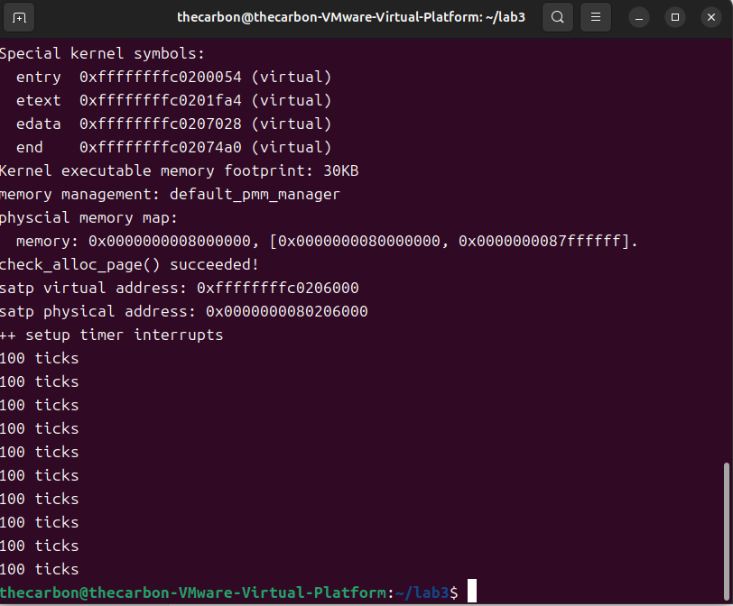

## 练习1：完善中断处理 （需要编程）
### 实验要求
请编程完善trap.c中的中断处理函数trap，在对时钟中断进行处理的部分填写kern/trap/trap.c函数中处理时钟中断的部分，使操作系统每遇到100次时钟中断后，调用print_ticks子程序，向屏幕上打印一行文字”100 ticks”，在打印完10行后调用sbi.h中的shut_down()函数关机。

要求完成问题1提出的相关函数实现，提交改进后的源代码包（可以编译执行），并在实验报告中简要说明实现过程和定时器中断中断处理的流程。实现要求的部分代码后，运行整个系统，大约每1秒会输出一次”100 ticks”，输出10行。

### 实现过程说明
先在kern/trap/trap.c添加全局变量ticks和num，分别用于记录打印次数：
```volatile size_t num = 0;```
之后找到interrupt_handler函数，在时钟中断处理部分添加代码：
```
        case IRQ_S_TIMER:
           clock_set_next_event();
           ticks++;
           if(ticks % TICK_NUM == 0){
               print_ticks();
               num++;
               if(num == 10){
                   sbi_shutdown();
               }
           }
           break;
```
首先调用clock.c中的clock_set_next_event()函数设置下一个时钟中断事件，然后将ticks变量加1，之后判断是否达到了100次中断，如果是则调用print_ticks()函数打印“100 ticks”，并将num变量加1，判断是否达到了10次打印，如果是则调用sbi_shutdown()函数关机。

### 定时器中断中断处理流程
采用Direct模式初始化stvec寄存器后，stvec直接指向唯一的中断处理程序入口点，所有类型的中断和异常都会跳转到这里。
1. 当时钟中断发生时，处理器会跳转到trapentry.S中的中断处理入口__alltraps。
2. 在__alltraps中，SAVE_ALL首先保存当前的CPU状态到trapframe中，move  a0, sp将参数传递给trap函数，然后调用trap函数。
3. 在trap函数中，调用trap_dispatch函数处理具体的中断类型。
4. 在trap_dispatch函数中，判断trap是由于中断触发，调用interrupt_handler函数。
5. 在interrupt_handler函数中，判断中断类型为IRQ_S_TIMER，执行相应的时钟中断处理代码。
6. 处理完中断后，trap函数返回，trapentry.S中的RESTORE_ALL恢复CPU状态，最后使用sret指令返回到中断发生前的执行点，继续执行程序。

### 实验结果
运行结果如图所示：



## 扩展练习Challenge3：完善异常中断
### 实验要求
编程完善在触发一条非法指令异常 mret和，在 kern/trap/trap.c的异常处理函数中捕获，并对其进行处理，简单输出异常类型和异常指令触发地址，即“Illegal instruction caught at 0x(地址)”，“ebreak caught at 0x（地址）”与“Exception type:Illegal instruction"，“Exception type: breakpoint”。

最开始根据ai说的执行非法指令(如除零)，不可恢复，只能终止程序执行，因此不更新epc寄存器；断点异常是调试时产生的异常，可以通过更新epc寄存器跳过断点指令继续执行程序，因此需要更新epc寄存器+4。但是这样并不会输出异常指令触发，会导致循环，多次触发print_trapframe。
实际上mret指令和ebreak指令都是可以恢复执行的，因此都需要更新epc寄存器，并且ebreak指令是2字节指令，因此epc+2，mret指令是4字节指令，因此epc+4。

非法指令异常
mret指令用于从M模式陷阱中返回。当M模式处理完中断，或S模式通过ecall请求的服务完成后，使用mret可以从M模式返回S模式，用户态无法执行mret指令，因此触发非法指令异常。
```
case CAUSE_ILLEGAL_INSTRUCTION:
             // 非法指令异常处理
             /* LAB3 CHALLENGE3   YOUR CODE :2312823  */
            /*(1)输出指令异常类型（ Illegal instruction）
             *(2)输出异常指令地址
             *(3)更新 tf->epc寄存器
            */
            cprintf("Exception type:Illegal instruction\n");
            cprintf("“Illegal instruction caught at 0x%08x\n", tf->epc);
            tf->epc += 4;
            break;
```
断点异常处理
```
case CAUSE_BREAKPOINT:
            //断点异常处理
            /* LAB3 CHALLENGE3   YOUR CODE :2312823  */
            /*(1)输出指令异常类型（ breakpoint）
             *(2)输出异常指令地址
             *(3)更新 tf->epc寄存器
            */
            cprintf("Exception type: breakpoint\n");
            cprintf("ebreak caught at 0x%08x\n", tf->epc);
            tf->epc += 2;
            break;
```
之后在init.c中通过内联汇编添加触发非法指令异常和断点异常的代码
```
    asm("ebreak");//触发断点异常
    asm("mret");//触发非法指令异常
```
运行结果如图：


