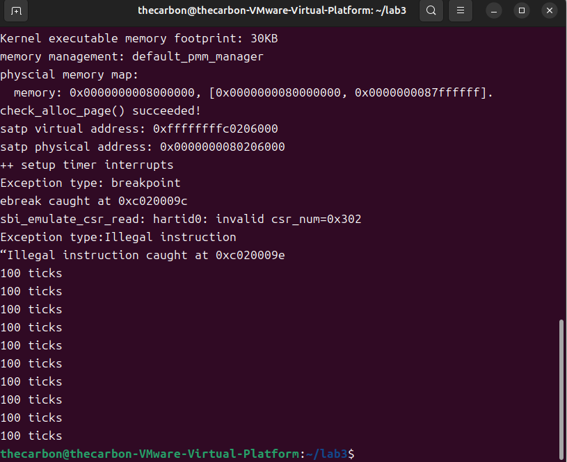

## 练习1：完善中断处理 （需要编程）
### 实验要求
请编程完善trap.c中的中断处理函数trap，在对时钟中断进行处理的部分填写kern/trap/trap.c函数中处理时钟中断的部分，使操作系统每遇到100次时钟中断后，调用print_ticks子程序，向屏幕上打印一行文字”100 ticks”，在打印完10行后调用sbi.h中的shut_down()函数关机。

要求完成问题1提出的相关函数实现，提交改进后的源代码包（可以编译执行），并在实验报告中简要说明实现过程和定时器中断中断处理的流程。实现要求的部分代码后，运行整个系统，大约每1秒会输出一次”100 ticks”，输出10行。

### 实现过程说明
先在kern/trap/trap.c添加全局变量ticks和num，分别用于记录打印次数：
```volatile size_t num = 0;```
之后找到interrupt_handler函数，在时钟中断处理部分添加代码：
```
        case IRQ_S_TIMER:
           clock_set_next_event();
           ticks++;
           if(ticks % TICK_NUM == 0){
               print_ticks();
               num++;
               if(num == 10){
                   sbi_shutdown();
               }
           }
           break;
```
首先调用clock.c中的clock_set_next_event()函数设置下一个时钟中断事件，然后将ticks变量加1，之后判断是否达到了100次中断，如果是则调用print_ticks()函数打印“100 ticks”，并将num变量加1，判断是否达到了10次打印，如果是则调用sbi_shutdown()函数关机。

### 定时器中断中断处理流程
采用Direct模式初始化stvec寄存器后，stvec直接指向唯一的中断处理程序入口点，所有类型的中断和异常都会跳转到这里。
1. 当时钟中断发生时，处理器会跳转到trapentry.S中的中断处理入口__alltraps。
2. 在__alltraps中，SAVE_ALL首先保存当前的CPU状态到trapframe中，move  a0, sp将参数传递给trap函数，然后调用trap函数。
3. 在trap函数中，调用trap_dispatch函数处理具体的中断类型。
4. 在trap_dispatch函数中，判断trap是由于中断触发，调用interrupt_handler函数。
5. 在interrupt_handler函数中，判断中断类型为IRQ_S_TIMER，执行相应的时钟中断处理代码。
6. 处理完中断后，trap函数返回，trapentry.S中的RESTORE_ALL恢复CPU状态，最后使用sret指令返回到中断发生前的执行点，继续执行程序。

### 实验结果
运行结果如图所示：


## 扩展练习 Challenge1：描述与理解中断流程
### 实验要求
回答：描述ucore中处理中断异常的流程（从异常的产生开始），其中mov a0，sp的目的是什么？SAVE_ALL中寄寄存器保存在栈中的位置是什么确定的？对于任何中断，__alltraps 中都需要保存所有寄存器吗？请说明理由。

### 练习解答
#### ucore中处理中断异常的流程
##### 异常/中断产生阶段

- CPU执行指令时检测到异常（非法指令、断点等）或外部中断（时钟中断等）

- 硬件自动保存当前PC到sepc寄存器，异常原因到scause寄存器

- CPU跳转到stvec寄存器指定的中断处理入口地址（__alltraps）

##### 现场保存阶段（trapentry.S）
```assembly

__alltraps:
    SAVE_ALL                    # 保存所有寄存器状态到栈中
    move a0, sp                 # 传递trapframe指针参数
    call trap                   # 调用C中断处理函数
```
- __alltraps标签为所有异常和中断的统一入口
- SAVE_ALL宏将所有通用寄存器和必要的CSR保存到当前栈帧中，形成trapframe结构体
- move a0, sp将当前栈指针sp（指向trapframe）传递给trap函数，作为第一个参数
- 调用trap函数进入C语言中断处理逻辑
##### 中断处理阶段（trap.c）

```c
void trap(struct trapframe *tf) {
    trap_dispatch(tf);          # 分发到具体处理程序
}

static inline void trap_dispatch(struct trapframe *tf) {
    if ((intptr_t)tf->cause < 0) {
        interrupt_handler(tf);   # 中断处理
    } else {
        exception_handler(tf);   # 异常处理
    }
}
```
- trap函数接收trapframe指针，调用trap_dispatch进行分发
- 根据cause寄存器判断是中断还是异常，调用相应处理函数
- 在interrupt_handler或exception_handler中根据具体类型执行相应逻辑（如时钟中断处理、非法指令处理等）
##### 现场恢复阶段
```assembly

    # trap函数返回后
    RESTORE_ALL                 # 从栈中恢复所有寄存器
    sret                        # 返回到被中断的代码
```
- trap函数处理完成后返回到trapentry.S
- RESTORE_ALL宏从栈中恢复所有寄存器状态
#### mov a0, sp的目的

主要目的：将当前栈指针sp作为参数传递给trap函数

详细说明：

- 在RISC-V调用约定中，a0寄存器用于传递第一个参数

- 执行SAVE_ALL后，sp指向栈顶的trapframe结构体

- mov a0, sp将trapframe的地址传递给trap(struct trapframe *tf)函数

- 这样C代码就能通过tf参数访问和修改所有保存的寄存器状态

作用：建立汇编层与C代码层之间的接口，使得C语言能够处理中断异常。

#### SAVE_ALL中寄存器保存在栈中的位置确定

位置确定方式：

按照struct trapframe结构体定义顺序

```c
struct trapframe {
    struct pushregs gpr;        // 通用寄存器
    uintptr_t status;           // sstatus
    uintptr_t epc;              // sepc  
    uintptr_t badvaddr;         // stval
    uintptr_t cause;            // scause
};
```

内存布局由编译器保证

- SAVE_ALL宏按照固定顺序压入寄存器

- 栈指针sp不断向下移动

- 每个寄存器在栈中的偏移位置由其在trapframe中的定义顺序决定

具体保存顺序：

```text
sp → [zero][ra][sp][gp][tp][t0]...[t6]  // 通用寄存器（32个）
     [sstatus][sepc][sbadaddr][scause]   // 控制状态寄存器

```
#### 对于任何中断，__alltraps中都需要保存所有寄存器吗？

需要保存所有寄存器

理由：

状态完整性原则

- 中断处理必须保证被中断程序的完全透明性

- 任何寄存器的改变都会破坏程序状态的一致性

- 必须保存所有寄存器才能完整恢复现场

处理程序的通用性

- 中断处理程序可能需要使用任意寄存器进行计算

- 如果不保存所有寄存器，处理程序会破坏原有程序状态

- 统一保存策略简化了中断处理的设计

中断类型的不确定性

- 在进入__alltraps时，尚未确定具体的中断类型

- 不同类型的中断可能需要不同的寄存器集合

- 保守策略：保存所有寄存器确保安全

RISC-V架构特点

- RISC-V有较多的通用寄存器（32个）

- 编译器可能将变量分配到任何寄存器中

- 无法预测哪些寄存器包含重要数据

实现简洁性

- 统一保存所有寄存器比选择性保存更简单可靠

- 避免了因保存不完整导致的难以调试的错误

## 扩展练习 Challenge2：理解上下文切换机制
### 实验要求
回答：在trapentry.S中汇编代码 csrw sscratch, sp；csrrw s0, sscratch, x0实现了什么操作，目的是什么？save all里面保存了stval scause这些csr，而在restore all里面却不还原它们？那这样store的意义何在呢？

### 练习解答
#### csrw sscratch, sp; csrrw s0, sscratch, x0操作和目的
- csrw sscratch, sp：将当前栈指针sp的值保存到sscratch临时寄存器。
- csrrw s0, sscratch, x0：将sscratch的值读取到安全寄存器s0，同时将x0（恒为0）写入sscratch，即清空sscratch。

目的：
- 保存当前模式的栈指针到sscratch，然后转移到安全寄存器s0中，确保栈指针的安全转移。
- 将sscratch清零，作为标志表示当前处于内核异常处理模式，为所有的异常提供相同的处理起点。
- 支持嵌套异常处理。

#### save all保存CSR但不还原的意义
CSR分为必须恢复和不需恢复两类，也就是程序状态寄存器和诊断信息寄存器。

前者如sstatus保存异常发生之前的中断状态并禁用中断操作，如果不恢复就会使中断保持禁用状态，后续系统无法响应中断。后者也就是题目中提到的stval和scause，stval记录异常相关的附加信息，scause记录异常原因编码，这些信息在异常处理完成后就已经完成其任务，没有必要还原。

虽然不必要还原诊断信息寄存器，但是保存这些信息可以帮助我们在后续遇到其他异常时根据这些信息进行诊断，并且避免在解决其他异常时恢复这些已经发生过的异常。

## 扩展练习Challenge3：完善异常中断
### 实验要求
编程完善在触发一条非法指令异常 mret和，在 kern/trap/trap.c的异常处理函数中捕获，并对其进行处理，简单输出异常类型和异常指令触发地址，即“Illegal instruction caught at 0x(地址)”，“ebreak caught at 0x（地址）”与“Exception type:Illegal instruction"，“Exception type: breakpoint”。

最开始根据ai说的执行非法指令(如除零)，不可恢复，只能终止程序执行，因此不更新epc寄存器；断点异常是调试时产生的异常，可以通过更新epc寄存器跳过断点指令继续执行程序，因此需要更新epc寄存器+4。但是这样并不会输出异常指令触发，会导致循环，多次触发print_trapframe。
实际上mret指令和ebreak指令都是可以恢复执行的，因此都需要更新epc寄存器，并且ebreak指令是2字节指令，因此epc+2，mret指令是4字节指令，因此epc+4。

非法指令异常
mret指令用于从M模式陷阱中返回。当M模式处理完中断，或S模式通过ecall请求的服务完成后，使用mret可以从M模式返回S模式，用户态无法执行mret指令，因此触发非法指令异常。
```
case CAUSE_ILLEGAL_INSTRUCTION:
             // 非法指令异常处理
             /* LAB3 CHALLENGE3   YOUR CODE :2312823  */
            /*(1)输出指令异常类型（ Illegal instruction）
             *(2)输出异常指令地址
             *(3)更新 tf->epc寄存器
            */
            cprintf("Exception type:Illegal instruction\n");
            cprintf("“Illegal instruction caught at 0x%08x\n", tf->epc);
            tf->epc += 4;
            break;
```
断点异常处理
```
case CAUSE_BREAKPOINT:
            //断点异常处理
            /* LAB3 CHALLENGE3   YOUR CODE :2312823  */
            /*(1)输出指令异常类型（ breakpoint）
             *(2)输出异常指令地址
             *(3)更新 tf->epc寄存器
            */
            cprintf("Exception type: breakpoint\n");
            cprintf("ebreak caught at 0x%08x\n", tf->epc);
            tf->epc += 2;
            break;
```
之后在init.c中通过内联汇编添加触发非法指令异常和断点异常的代码
```
    asm("ebreak");//触发断点异常
    asm("mret");//触发非法指令异常
```
运行结果如图：


