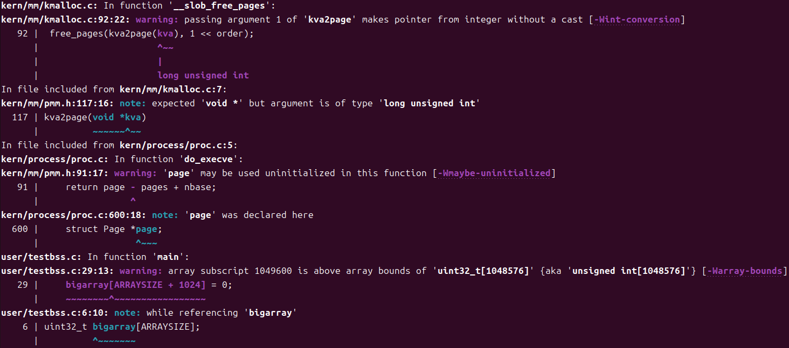
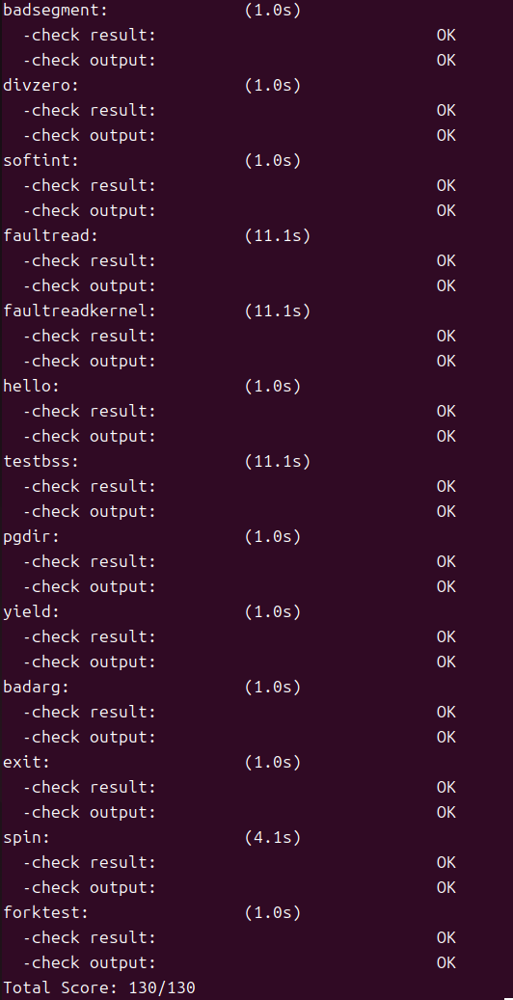
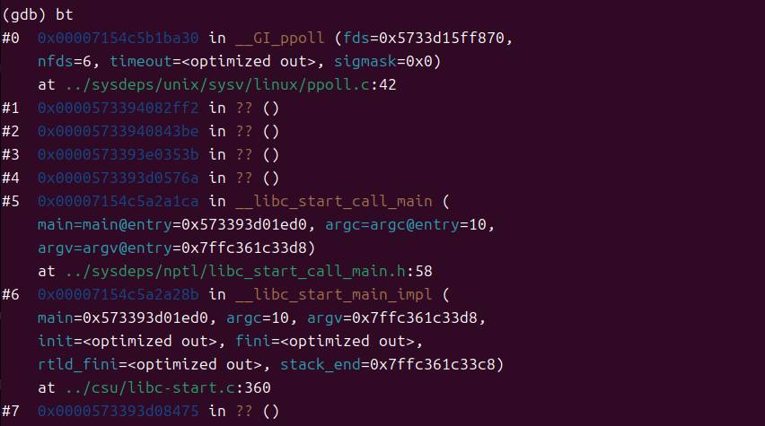
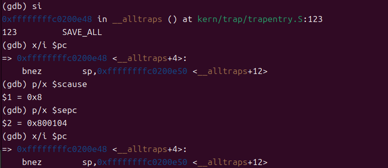
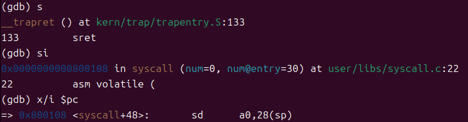

# Lab2 分支任务：gdb 调试页表查询过程

## 1. 实验概述
本实验旨在利用 GDB 调试器和 QEMU 模拟器，建立一个“透视”环境，观察 ucore 操作系统在 RISC-V 架构下的虚拟内存管理机制。通过在 QEMU 源码的关键位置设置断点，捕获从虚拟地址到物理地址的翻译过程，并验证了 ucore 启动时的页表映射策略。

## 2. QEMU 地址翻译源码分析

在 QEMU 中，RISC-V 架构的 MMU 模拟主要集中在 `target/riscv/cpu_helper.c` 文件中。

### 关键调用路径
当 CPU 执行一条访存指令（如取指、加载、存储）时，如果 TLB 中没有对应的映射（TLB Miss），QEMU 会触发以下调用链：

1.  **`riscv_cpu_tlb_fill`** (`target/riscv/cpu_helper.c:435`)
    *   这是 TLB 缺失处理的入口函数。它负责调用翻译函数，并根据翻译结果填充软件 TLB 或抛出异常（Page Fault）。
2.  **`get_physical_address`** (`target/riscv/cpu_helper.c:155`)
    *   这是核心的页表遍历函数。它模拟硬件 MMU 的行为，逐级读取页表项。

### 关键代码逻辑
在 `get_physical_address` 函数中，核心逻辑是一个 `for` 循环，模拟多级页表的遍历：

```c
// target/riscv/cpu_helper.c:237
for (i = 0; i < levels; i++, ptshift -= ptidxbits) {
    // 1. 计算当前级页表项的物理地址
    target_ulong pte_addr = base + idx * ptesize;

    // 2. 模拟物理内存读取 (关键操作)
    target_ulong pte = ldq_phys(cs->as, pte_addr);

    // 3. 检查页表项有效位 (V位)
    if (!(pte & PTE_V)) {
        return TRANSLATE_FAIL; // 无效映射
    } 
    // 4. 检查是否为叶子节点 (R/W/X 位不全为0)
    else if ((pte & (PTE_R | PTE_W | PTE_X))) {
        // 找到了物理页，跳出循环，计算最终物理地址
        goto translation_done; 
    }
    // 5. 如果不是叶子节点，继续下一级
    base = ppn << PGSHIFT;
}
```

## 3. 单步调试页表翻译流程

### 实验场景
*   **观测对象**：内核初始化函数 `kern_init` 的入口地址。
*   **目标虚拟地址**：`0xffffffffc02000d6`。
*   **调试工具**：GDB (连接 QEMU) + GDB (连接 ucore)。

### 调试过程
在调试中，我们观察到 `get_physical_address` 函数被调用。在 SV39 分页模式下，`levels` 被设置为 3，意味着页表树最多有三层（根页表 -> 中间页表 -> 叶子页表）。

然而，在本次实验中，我们发现：

**第一次循环 (Level 2)**：
    QEMU 计算出 PTE 地址为 `0x80205ff8`。
    读取到的 PTE 值为 `0x200000cf`。

**分析**：二进制展开 `... 1100 1111`。
    *   `PTE_V` (有效) = 1
    *   `PTE_R` (读) = 1, `PTE_W` (写) = 1, `PTE_X` (执行) = 1

**结论**：这是一个叶子节点，尽管它处于页表树的顶层（Level 2）。
    
**结果**：循环只执行了一次就提前结束了。

### 现象解释
这证明了 ucore 在内核启动初期使用了 **1GB 大页 (Gigapage)** 进行恒等映射。
*   虚拟地址 `0xffffffffc02000d6` 对应的 VPN[2] 索引是 511。
*   内核直接在根页表的第 511 项填入了物理页号 `0x80000` (对应物理地址 `0x80000000`)，并设置了 RWX 权限。
*   这样，整个 `0xffffffffc0000000` 以上的 1GB 虚拟空间都被直接映射到了物理内存，无需经过后续的两级页表查找。这是一种常见的内核优化手段。

## 4. QEMU TLB 与 真实 CPU TLB 的异同

### 查找 TLB 的代码
在 QEMU 中，模拟 TLB 查找的代码通常是由 TCG (Tiny Code Generator) 动态生成的汇编代码，直接在宿主机内存中查表，很难直接在 C 源码层面找到“查找”的那一行。
但是，我们可以找到 **TLB 填充 (Refill)** 的代码，即 `riscv_cpu_tlb_fill`。
*   **RISC-V 流程**：硬件自动遍历页表。
    *   CPU 发出访存 -> 查 TLB -> Miss -> **硬件状态机启动** -> 遍历页表 -> 填入 TLB -> 重试。
*   **QEMU 流程**：软件模拟。
    *   执行 TCG 指令 -> 查软件 TLB 数组 -> Miss -> **调用 C 辅助函数 (`tlb_fill`)** -> 软件读取物理内存 (`ldq_phys`) -> 填入软件 TLB (`tlb_set_page`)。

### 逻辑区别
1.  **并发性**：真实 CPU 的 TLB 是全相联或组相联的硬件电路，可以并行比较所有条目。QEMU 的 TLB 是一个软件哈希表（`CPUTLBEntry`），通过索引直接访问。
2.  **Miss 处理**：
    *   **真实 RISC-V**：TLB Miss 是硬件行为，对软件（操作系统）透明，除非发生 Page Fault。
    *   **QEMU**：TLB Miss 会导致从“快速路径”（执行编译好的代码）切换到“慢速路径”（调用 C 函数），这对宿主机 CPU 来说是一次昂贵的函数调用。
3.  **未开启虚拟内存时**：
    *   调试发现，当 `satp` 未设置或 `mstatus.MPRV` 未开启时，`get_physical_address` 会直接返回 `TRANSLATE_SUCCESS`，物理地址等于虚拟地址。
    *   在真实硬件中，这对应于 MMU 被旁路（Bypass）。

## 5. 实验中的有趣细节

**循环次数**：
在调试前，我预期会看到三次 `ldq_phys` 调用，分别对应三级页表。结果只看到了一次。起初我以为是调试器出了问题。经过分析 PTE 的权限位才发现原来是 1GB 大页！这一刻我深刻体会到了设计者为了性能所做的精妙设计。

## 6. 大模型辅助记录

在本次实验中，GitHub Copilot (Gemini 3 Pro) 发挥了重要作用：

**确定观测地址**

**问题**：我需要一个确定的虚拟地址来设置条件断点。

**交互**：模型建议使用内核入口点，并通过读取 `lab2/obj/kernel.asm` 文件，帮我找到了 `kern_init` 的确切地址 `0xffffffffc02000d6`。这大大节省了我翻阅反汇编代码的时间。

通过这次实验，我不仅掌握了 GDB + QEMU 的高级调试技巧，更通过“上帝视角”亲眼见证了虚拟内存从抽象概念到具体代码实现的转化过程。

# Lab5
## 练习0：填写已有实验
### 实验要求
本实验依赖实验2/3/4。请把你做的实验2/3/4的代码填入本实验中代码中有“LAB2”/“LAB3”/“LAB4”的注释相应部分。注意：为了能够正确执行 lab5 的测试应用程序，可能需对已完成的实验2/3/4的代码进行进一步改进。

### 修改
可以发现lab5\kern\process\proc.c中的alloc_proc函数和do_fork函数中有LAB5 YOUR CODE : (update LAB4 steps)的注释，表示需要对实验4的代码进行更新。
alloc_proc函数中需要初始化proc_struct结构体中新添加的字段wait_state、cptr、yptr和optr，代码如下：
```c
        proc->wait_state = 0;
        proc->cptr = NULL;
        proc->yptr = NULL;
        proc->optr = NULL;
```

do_fork函数中需要设置子进程的父进程指针parent，并在插入进程列表时调用set_links函数来设置进程间的关系链接，如下：

step 1后添加：
```c
    proc->parent = current;
```

step 5修改前:

```c
    proc->pid = get_pid();
    hash_proc(proc);
    list_add(&proc_list, &(proc->list_link));
    nr_process++;
```
修改后:
```c
    proc->pid = get_pid();
    hash_proc(proc);
    set_links(proc);
```

## 练习1: 加载应用程序并执行（需要编码）
### 实验要求
do_execve函数调用load_icode（位于kern/process/proc.c中）来加载并解析一个处于内存中的ELF执行文件格式的应用程序。你需要补充load_icode的第6步，建立相应的用户内存空间来放置应用程序的代码段、数据段等，且要设置好proc_struct结构中的成员变量trapframe中的内容，确保在执行此进程后，能够从应用程序设定的起始执行地址开始执行。需设置正确的trapframe内容。

请在实验报告中简要说明你的设计实现过程。
- 请简要描述这个用户态进程被ucore选择占用CPU执行（RUNNING态）到具体执行应用程序第一条指令的整个经过。

### 代码实现
根据提示，在load_icode函数中补充了以下代码：

```c
tf->gpr.sp = USTACKTOP;
tf->epc = elf->e_entry;
tf->status = (sstatus & ~SSTATUS_SPP) | SSTATUS_SPIE;
```
USTACKTOP表示用户堆栈的顶部地址，elf->e_entry表示ELF文件中定义的程序入口点地址，sstatus是当前进程的状态寄存器值，SPP为陷阱发生时的特权级别，SPIE为中断使能位的前一个值。通过这些设置，确保用户态进程能够正确返回并从入口点开始执行应用程序的第一条指令。

### 执行过程
1. 更新后的init_proc函数会通过kernel_thread函数创建一个内核线程user_main，该线程负责执行用户程序。
2. user_main中执行了kern_execve("exit", _binary_obj___user_exit_out_start,_binary_obj___user_exit_out_size)，调用kern_execve函数加载并执行名为"exit"的用户程序。
3. kern_execve函数中用ebreak产生断点中断进行处理，通过设置 a7 寄存器的值为10说明这不是一个普通的断点中断，而是要转发到syscall()处理。
4. syscall()函数根据 a7 寄存器的值调用sys_execve函数，sys_execve函数最终调用do_execve函数来加载用户程序。
5. do_execve函数调用load_icode函数加载用户程序的ELF文件，并设置好进程的内存空间和trapframe。
6. 在trap返回的时候调用了 sret 指令，这时只要 sstatus 寄存器的 SPP 二进制位为0，就会切换到 U mode，但 SPP 存储的是“进入 trap 之前来自什么特权级”，也就是说我们这里 ebreak 之后 SPP 的数值为1，sret 之后会回到 S mode 在内核态执行用户程序。

## 练习2: 父进程复制自己的内存空间给子进程（需要编码）
### 实验要求
创建子进程的函数do_fork在执行中将拷贝当前进程（即父进程）的用户内存地址空间中的合法内容到新进程中（子进程），完成内存资源的复制。具体是通过copy_range函数（位于kern/mm/pmm.c中）实现的，请补充copy_range的实现，确保能够正确执行。

请在实验报告中简要说明你的设计实现过程。

- 如何设计实现Copy on Write机制？给出概要设计，鼓励给出详细设计。

>Copy-on-write（简称COW）的基本概念是指如果有多个使用者对一个资源A（比如内存块）进行读操作，则每个使用者只需获得一个指向同一个资源A的指针，就可以该资源了。若某使用者需要对这个资源A进行写操作，系统会对该资源进行拷贝操作，从而使得该“写操作”使用者获得一个该资源A的“私有”拷贝—资源B，可对资源B进行写操作。该“写操作”使用者对资源B的改变对于其他的使用者而言是不可见的，因为其他使用者看到的还是资源A。

### 代码实现
根据提示，在copy_range函数中补充了以下代码：

```c
            uintptr_t* src_kvaddr = page2kva(page);
            uintptr_t* dst_kvaddr = page2kva(npage);
            memcpy((void *)dst_kvaddr, (void *)src_kvaddr, PGSIZE);
            ret = page_insert(to, npage, start, perm);
```
1. 通过page2kva函数获取源页面和新页面的内核虚拟地址。
2. 使用memcpy函数将源页面的内容复制到新页面中，确保子进程拥有与父进程相同的内存内容。
3. 使用page_insert函数将新页面映射到子进程的页表中，确保子进程能够访问这些内存内容。

### COW设计实现
页表项中的包括权限位PTE_R（读）、PTE_W（写）。在实现COW机制时，可以将父进程的页表项中的PTE_W权限位清除，只保留PTE_R权限位。这样，当子进程尝试写入该页面时，会触发一个页错误异常，内核可以捕获该异常并进行处理；如果是读操作，则可以正常进行。

## 练习3: 阅读分析源代码，理解进程执行 fork/exec/wait/exit 的实现，以及系统调用的实现（不需要编码）
### 实验要求
请在实验报告中简要说明你对 fork/exec/wait/exit函数的分析。并回答如下问题：

- 请分析fork/exec/wait/exit的执行流程。重点关注哪些操作是在用户态完成，哪些是在内核态完成？内核态与用户态程序是如何交错执行的？内核态执行结果是如何返回给用户程序的？
- 请给出ucore中一个用户态进程的执行状态生命周期图（包执行状态，执行状态之间的变换关系，以及产生变换的事件或函数调用）。（字符方式画即可）
执行：make grade。如果所显示的应用程序检测都输出ok，则基本正确。（使用的是qemu-4.1.1）

### 执行流程分析
#### fork
```c
\user\libs\ulib.c
int
fork(void) {
    return sys_fork();
}
```

```c
\user\libs\syscall.c
int
sys_fork(void) {
    return syscall(SYS_fork);
}
```

```c
\user\libs\syscall.c
static inline int
syscall(int64_t num, ...) {
    //va_list, va_start, va_arg都是C语言处理参数个数不定的函数的宏
    //在stdarg.h里定义
    va_list ap; //ap: 参数列表(此时未初始化)
    va_start(ap, num); //初始化参数列表, 从num开始
    //First, va_start initializes the list of variable arguments as a va_list.起初，va_start将可变参数列表初始化为va_list。
    uint64_t a[MAX_ARGS];
    int i, ret;
    for (i = 0; i < MAX_ARGS; i ++) { //把参数依次取出
        a[i] = va_arg(ap, uint64_t);
    }
    va_end(ap);//Finally, va_end shall be executed before the function returns.最后，在函数返回之前应执行 va_end。

    asm volatile (
        "ld a0, %1\n"
        "ld a1, %2\n"
        "ld a2, %3\n"
        "ld a3, %4\n"
        "ld a4, %5\n"
    	"ld a5, %6\n"
        "ecall\n"
        "sd a0, %0"
        : "=m" (ret)
        : "m"(num), "m"(a[0]), "m"(a[1]), "m"(a[2]), "m"(a[3]), "m"(a[4])
        :"memory");
    //num存到a0寄存器， a[0]存到a1寄存器
    //ecall的返回值存到ret
    return ret;
}
```

```c
\kern\trap\trap.c
case CAUSE_USER_ECALL: //通过中断帧里 scause寄存器的数值，判断出当前是来自USER_ECALL的异常
        // cprintf("Environment call from U-mode\n");
        tf->epc += 4;
        //sepc寄存器是产生异常的指令的位置，在异常处理结束后，会回到sepc的位置继续执行
        //对于ecall, 我们希望sepc寄存器要指向产生异常的指令(ecall)的下一条指令
        //否则就会回到ecall执行再执行一次ecall, 无限循环
        syscall();
        break;
```

```c
\kern\syscall\syscall.c
void
syscall(void) {
    struct trapframe *tf = current->tf;
    uint64_t arg[5];
    int num = tf->gpr.a0;//a0寄存器保存了系统调用编号
    if (num >= 0 && num < NUM_SYSCALLS) {//防止syscalls[num]下标越界
        if (syscalls[num] != NULL) {
            arg[0] = tf->gpr.a1;
            arg[1] = tf->gpr.a2;
            arg[2] = tf->gpr.a3;
            arg[3] = tf->gpr.a4;
            arg[4] = tf->gpr.a5;
            tf->gpr.a0 = syscalls[num](arg);
            //把寄存器里的参数取出来，转发给系统调用编号对应的函数进行处理
            return ;
        }
    }
    print_trapframe(tf);
    panic("undefined syscall %d, pid = %d, name = %s.\n",
            num, current->pid, current->name);
}
```
1. 用户态进程调用fork系统调用，触发陷阱进入内核态。
2. 内核态执行sys_fork函数，调用do_fork函数创建子进程。
3. do_fork函数调用alloc_proc分配新的proc_struct，并调用copy_range复制父进程的内存空间到子进程。
4. do_fork函数设置子进程的trapframe，并将子进程加入就绪队列。
5. 内核态返回子进程的PID给父进程，父进程继续执行。

#### exec
代码流程与fork类似，不再赘述。

1. 用户态进程调用exec系统调用，触发陷阱进入内核态。
2. 内核态执行sys_execve函数，调用do_execve函数加载新的用户程序。
3. do_execve函数调用load_icode加载用户程序的ELF文件，并设置好进程的内存空间和trapframe。
4. 内核态返回，进程继续执行新的用户程序。

#### wait
1. 用户态进程调用wait系统调用，触发陷阱进入内核态。
2. 内核态执行sys_wait函数，调用do_wait函数等待子进程结束。
3. do_wait函数检查子进程状态，如果子进程未结束，则将当前进程挂起，等待子进程结束。
4. 当子进程结束时，内核态唤醒父进程，并返回子进程的PID和退出状态给父进程。
5. 内核态返回，父进程继续执行。

#### exit
1. 用户态进程调用exit系统调用，触发陷阱进入内核态。
2. 内核态执行sys_exit函数，调用do_exit函数结束进程。
3. do_exit函数释放进程的资源，设置进程状态为结束，并唤醒等待该进程的父进程。
4. 内核态返回，进程终止执行。

#### 内核态与用户态交错执行
用户态进程通过系统调用触发陷阱进入内核态，内核态执行相应的系统调用处理函数，完成所需操作后通过返回用户态继续执行。内核态与用户态通过trapframe结构体保存和恢复寄存器状态，实现状态切换。
内核态执行结果通过修改trapframe中的寄存器值返回给用户态进程，用户态进程继续执行时可以获取这些结果。

### 进程状态生命周期图
执行状态包括：PROC_UNINIT, PROC_SLEEPING, PROC_RUNNABLE, PROC_RUNNING, PROC_ZOMBIE
产生变换的事件或函数调用包括：fork, exec, wait, exit, 调度器调度等。
``` 

            +------------------+
            |   PROC_UNINIT    |
            +------------------+
                     |
                     | fork
                     v
            +------------------+
            |  PROC_RUNNABLE   |
            +------------------+
                     |
                     | sechedule
                     v
            +------------------+
            |   PROC_RUNNING   |
            +------------------+
                     |
             +---------+---------+
             |                   |
         exec                 exit
             |                   |
             v                   v
    +------------------+   +------------------+
    |  PROC_RUNNABLE   |   |   PROC_ZOMBIE    |
    +------------------+   +------------------+
             |
             | wait
             v
    +------------------+
    |  PROC_SLEEPING   |
    +------------------+
             |
             | wake up
             v
    +------------------+
    |  PROC_RUNNABLE   |
    +------------------+
```

### 实验结果
执行前先将default_timeout设置为10，执行make grade命令后，首先输出一些警告信息，这些信息可以忽略。


实验结果如图所示，所有测试均通过。



## 扩展练习 Challenge1：实现 Copy on Write （COW）机制
### 实验要求
给出实现源码,测试用例和设计报告（包括在cow情况下的各种状态转换（类似有限状态自动机）的说明）。

这个扩展练习涉及到本实验和上一个实验“虚拟内存管理”。在ucore操作系统中，当一个用户父进程创建自己的子进程时，父进程会把其申请的用户空间设置为只读，子进程可共享父进程占用的用户内存空间中的页面（这就是一个共享的资源）。当其中任何一个进程修改此用户内存空间中的某页面时，ucore会通过page fault异常获知该操作，并完成拷贝内存页面，使得两个进程都有各自的内存页面。这样一个进程所做的修改不会被另外一个进程可见了。请在ucore中实现这样的COW机制。

由于COW实现比较复杂，容易引入bug，请参考 https://dirtycow.ninja/ 看看能否在ucore的COW实现中模拟这个错误和解决方案。需要有解释。

这是一个big challenge.

### 源码尝试
在kern/mm/pmm.c的copy_range函数中，发现参数@share: flags to indicate to dup OR share. We just use dup method, so it didn't be used.的注释表明目前只使用dup方法，没有使用share方法。于是在copy_range函数中尝试添加了对share参数的处理逻辑，
```c
        if(share){
                ret |= page_insert(to, page, start, perm & ~PTE_W);
                ret |= page_insert(from, page, start, perm & ~PTE_W);
            }
            else{
                uintptr_t* src_kvaddr = page2kva(page);
                uintptr_t* dst_kvaddr = page2kva(npage);
                memcpy((void *)dst_kvaddr, (void *)src_kvaddr, PGSIZE);
                ret = page_insert(to, npage, start, perm);
            }
```

在share为true时，表示父进程和子进程共享同一页面，并将该页面的写权限去掉（perm & ~PTE_W），以实现COW机制。当任一进程尝试写入该页面时，会触发页错误异常，内核可以捕获该异常并进行处理。

## 扩展练习 Challenge2：说明该用户程序是何时被预先加载到内存中的？与我们常用操作系统的加载有何区别，原因是什么？

### q1
用户程序是在内核初始化过程中通过init_proc函数创建的内核线程user_main中被预先加载到内存中的。user_main函数调用kern_execve函数来加载并执行用户程序。在kern_execve函数中，通过调用do_execve函数来加载用户程序的ELF文件，并设置好进程的内存空间和trapframe。

### q2
Windows加载用户程序时，用户双击 exe 或通过 CreateProcess API 启动程序时，内核会创建一个新进程，分配独立的虚拟地址空间，并将用户程序的代码和数据段加载到该地址空间中。Windows 使用按需分页技术，只有在程序访问某个页面时，才会将该页面加载到内存中。

Linux加载用户程序时，用户通过 execve 系统调用启动程序，内核创建新进程，分配虚拟地址空间，并将用户程序的代码和数据段加载到该地址空间中。Linux 也使用按需分页技术，只有在程序访问某个页面时，才会将该页面加载到内存中。

macOS加载用户程序时与Linux类似。

区别在于ucore在内核初始化过程中就预先加载了用户程序，而不是在用户请求时才加载。这种设计简化了系统的启动过程，但可能会占用更多的内存资源，因为所有预定义的用户程序都会被加载到内存中。

# Lab5 分支任务：gdb 调试系统调用以及返回

## 1. 实验概述
本实验旨在利用“双重 GDB”调试技术（Kernel GDB + Host GDB），深入观察 RISC-V 架构下用户态与内核态切换的关键指令 `ecall` 和 `sret` 的执行流程。通过监控 QEMU 模拟器的行为，验证硬件异常处理机制，并理解 QEMU 的 TCG 指令翻译原理。

## 2. 双重 GDB 调试流程

### 2.1 环境准备与符号加载
首先启动 QEMU 调试模式 (`make debug`)。在 Kernel GDB 中，为了能调试用户态程序，我们需要手动加载用户程序的符号表：
```gdb
add-symbol-file obj/__user_exit.out
```
随后在 `user/libs/syscall.c` 的 `syscall` 函数处设置断点。

### 2.2 Host GDB 的“透视”尝试（遇到的挑战）
为了观察 QEMU 如何处理指令，我们尝试开启第二个终端，使用 Host GDB 附加到 QEMU 进程：
```bash
sudo gdb -p $(pgrep qemu)
```
**现象**：连接成功，但查看调用栈时发现 QEMU 二进制文件缺少调试符号（Debug Symbols），栈帧显示为 `??`。


*图1：Host GDB 附加到 QEMU 进程，显示无调试符号*

这迫使我们调整策略：无法直接在 QEMU 源码函数（如 `riscv_raise_exception`）打断点，转而通过 Kernel GDB 观察寄存器状态变化来验证 QEMU 的行为。

### 2.3 追踪 `ecall`：用户态 -> 内核态
在 Kernel GDB 中单步执行到 `ecall` 指令前，记录当前状态。执行 `si` 单步指令后，观察寄存器变化：


*图2：执行 ecall 后，scause 变为 8，sepc 记录了 ecall 地址*

**观察结果**：
1.  `scause` 寄存器变为 `0x8` (User environment call)，证明 QEMU 正确捕获了系统调用异常。
2.  `sepc` 寄存器记录了异常发生时的指令地址 `0x800104`。
3.  `pc` 指针跳转到了内核陷阱处理入口 `__alltraps`。

### 2.4 追踪 `sret`：内核态 -> 用户态
继续执行直到 `kern/trap/trapentry.S` 中的 `__trapret` 阶段。单步执行 `sret` 指令：


*图3：执行 sret 后，pc 指针正确跳回用户程序*

**观察结果**：
`pc` 指针从内核高地址瞬间跳回了用户空间的 `0x800108`（即 `ecall` 的下一条指令），证明特权级和上下文已成功恢复。

## 3. QEMU 原理分析：TCG 与指令翻译

### 3.1 ecall 与 sret 的处理逻辑
在 QEMU 源码中（虽然本次实验因缺失符号未直接断点，但结合理论分析）：
*   **`ecall`**：被 TCG (Tiny Code Generator) 翻译为调用辅助函数（Helper Function）。该函数会设置 `scause`、`sepc` 等 CSR 寄存器，并将 `pc` 更新为 `stvec` 的值，模拟硬件的中断跳转。
*   **`sret`**：同样被翻译为辅助函数。它读取 `sepc` 的值赋给 `pc`，并根据 `sstatus.SPP` 恢复特权级（从 S 模式切回 U 模式）。

### 3.2 TCG Translation (指令翻译)
QEMU 不像简单的解释器那样逐条解释指令，而是使用 TCG 将目标机器（RISC-V）的基本块（Basic Block）动态翻译成宿主机（x86_64）的机器码。
*   **双重 GDB 的关联**：当我们用 Host GDB 暂停 QEMU 时，我们实际上是暂停了宿主机的执行流。如果 QEMU 正在执行翻译好的代码块，我们看到的调用栈往往停在 `cpu_exec` 或 `tcg_qemu_tb_exec` 等核心循环中。本次实验中看到的 `ppoll` 说明 QEMU 当时处于空闲等待状态。

## 4. 实验中的“抓马”细节与知识点

1.  **权限的“闭门羹”**：
    起初尝试 `gdb -p` 时报错 `ptrace: Operation not permitted`。这是 Linux 的 YAMA 安全机制在作祟，禁止非父子进程调试。解决方法是加上 `sudo`。

2.  **死锁危机 (Deadlock)**：
    当 Host GDB 暂停 QEMU 进程后，Kernel GDB 发送的指令无法得到响应，报错 `Ignoring packet error`。
    **知识点**：调试器与被调试程序是 C/S 架构。服务端（QEMU）被挂起时，客户端（Kernel GDB）会超时。必须在 Host GDB 中 `detach` 释放进程，或者在 Kernel GDB 设置 `set remotetimeout unlimited`。

3.  **消失的符号**：
    最“抓马”的是发现 QEMU 是 stripped binary。这打破了原本“在 QEMU 源码打断点”的计划。但这也让我们学会了通过观察硬件状态（寄存器）来反推模拟器行为的“黑盒调试法”。

## 5. 大模型辅助记录

在本次实验中，GitHub Copilot (Gemini 3 Pro) 提供了关键支持：

**场景 1：双 GDB 死锁**
*   **问题**：Host GDB attach 后，Kernel GDB 无法单步调试。
*   **交互**：模型指出这是因为 QEMU 进程被挂起，导致 RSP 协议超时。模型建议在 Host GDB 操作完后立即 `detach`，并在 Kernel GDB 设置超时忽略。

**场景 2：QEMU 无符号的应对**
*   **问题**：无法在 `riscv_raise_exception` 打断点。
*   **交互**：模型迅速调整方案，建议我放弃源码断点，转为在 Kernel GDB 中通过 `p/x $scause` 和 `p/x $sepc` 来验证 `ecall` 的执行效果。这种灵活的变通保证了实验报告的完整性。

**场景 3：用户态断点设置**
*   **问题**：`break syscall` 总是断在内核函数。
*   **交互**：模型提醒我 `syscall` 函数在用户库和内核中同名，指导我使用 `break user/libs/syscall.c:syscall` 精确指定断点位置。

## 7. 原理分析：用户态与内核态的切换机制

通过阅读 `kern/trap/trapentry.S` 和相关源码，我们可以深入理解 ucore 中用户态与内核态切换的具体实现。

### 7.1 用户态 -> 内核态 (Trap Entry)
当用户程序执行 `ecall` 指令发起系统调用时，硬件和软件共同协作完成了特权级的切换。

1.  **硬件自动操作**：
    *   **更新 CSR**：硬件将异常原因写入 `scause`（系统调用为 8），将当前指令地址写入 `sepc`，将当前特权级（User）保存到 `sstatus.SPP`。
    *   **跳转**：硬件将 `pc` 设置为 `stvec` 寄存器的值。在 `kern/trap/trap.c` 的 `idt_init` 中，`stvec` 被设置为 `__alltraps` 的地址。

2.  **软件保存上下文 (`__alltraps`)**：
    *   **栈切换 (Stack Swap)**：
        ```asm
        csrrw sp, sscratch, sp
        bnez sp, _save_context
        ```
        这是最关键的一步。在用户态运行时，`sscratch` 寄存器保存了**内核栈指针 (Kernel Stack Pointer)**。
        *   `csrrw` 指令交换了 `sp` 和 `sscratch`。此时，`sp` 指向了内核栈，而 `sscratch` 保存了刚才的用户栈指针。
        *   如果是从内核态重入（Nested Trap），`sscratch` 为 0，交换后 `sp` 为 0。代码通过 `bnez` 检查并处理这种情况，确保始终使用正确的内核栈。
    *   **保存寄存器**：
        接下来，代码通过 `STORE` 指令将所有通用寄存器（x1-x31）压入内核栈，构建 `trapframe` 结构体。
        特别地，它将 `sscratch`（此时保存着用户栈指针）的值读出并保存到 `trapframe` 的 `sp` 位置，确保用户栈信息不丢失。
    *   **调用处理函数**：
        最后，将 `sp`（指向 `trapframe` 的首地址）作为参数传递给 `a0`，并调用 `trap` 函数进行分发处理。

### 7.2 内核态 -> 用户态 (Trap Return)
当系统调用处理完毕（如 `syscall` 返回），内核调用 `__trapret` 恢复上下文并返回用户态。

1.  **软件恢复上下文 (`__trapret`)**：
    *   **恢复 CSR**：从栈中弹出 `sstatus` 和 `sepc` 的值，并写入对应寄存器。`sstatus` 中的 `SPP` 位此时应为 0（代表用户态）。
    *   **保存内核栈指针**：
        ```asm
        addi s0, sp, 36 * REGBYTES
        csrw sscratch, s0
        ```
        在切回用户态之前，内核必须把当前的内核栈顶地址保存回 `sscratch` 寄存器。这样，下一次发生中断或系统调用时，硬件才能找到内核栈。
    *   **恢复通用寄存器**：
        使用 `LOAD` 指令从 `trapframe` 中恢复所有通用寄存器。
        **关键点**：最后一步恢复 `sp` 寄存器 (`LOAD x2, ...`)。这将 `sp` 重新指向了用户栈。

2.  **硬件执行返回 (`sret`)**：
    *   执行 `sret` 指令时，CPU 会：
        *   将 `pc` 设置为 `sepc` 的值（即 `ecall` 的下一条指令地址）。
        *   根据 `sstatus.SPP` 切换特权级（回到 User Mode）。
        *   根据 `sstatus.SPIE` 恢复中断使能状态。

通过这种机制，ucore 保证了用户程序和内核程序拥有独立的栈空间，并且在切换过程中能够完整地保存和恢复执行现场。

## 6. 附录：可复现的操作命令清单

为了方便复现本次实验，以下整理了三个终端的完整操作脚本：

### Terminal 1: 启动 QEMU
```bash
cd ~/labcodes/OS/lab5
make clean
make
make debug
# 等待 GDB 连接...
```

### Terminal 2: Kernel GDB (主控制台)
```bash
riscv64-unknown-elf-gdb
```
在 GDB 内部输入：
```gdb
target remote :1234
set remotetimeout unlimited       # 关键：防止 Host GDB 暂停 QEMU 时超时
file bin/kernel
add-symbol-file obj/__user_exit.out  # 加载用户程序符号
break user/libs/syscall.c:syscall    # 精确断点
continue

# --- 此时程序停在 syscall 函数入口 ---
# 输入 si 并回车，重复多次，直到看到 ecall 指令
# 此时暂停操作，切换到 Terminal 3
```

### Terminal 3: Host GDB (观察者)
```bash
pgrep -a qemu   # 获取 PID，例如 12345
sudo gdb -p 12345
```
在 GDB 内部输入：
```gdb
bt              # 查看调用栈 (截图点 1)
detach          # 关键：释放 QEMU 进程
quit
```

### Terminal 2: Kernel GDB (继续追踪)
回到 Terminal 2 继续操作：
```gdb
# --- 验证 ecall ---
si              # 执行 ecall
p/x $scause     # 应为 0x8 (截图点 2)
p/x $sepc       # 应为 ecall 地址

# --- 验证 sret ---
break __trapret
continue
# 输入 si 重复多次，直到看到 sret 指令
si              # 执行 sret
x/i $pc         # 验证是否回到用户地址 (截图点 3)
```
