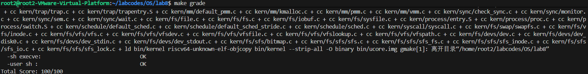
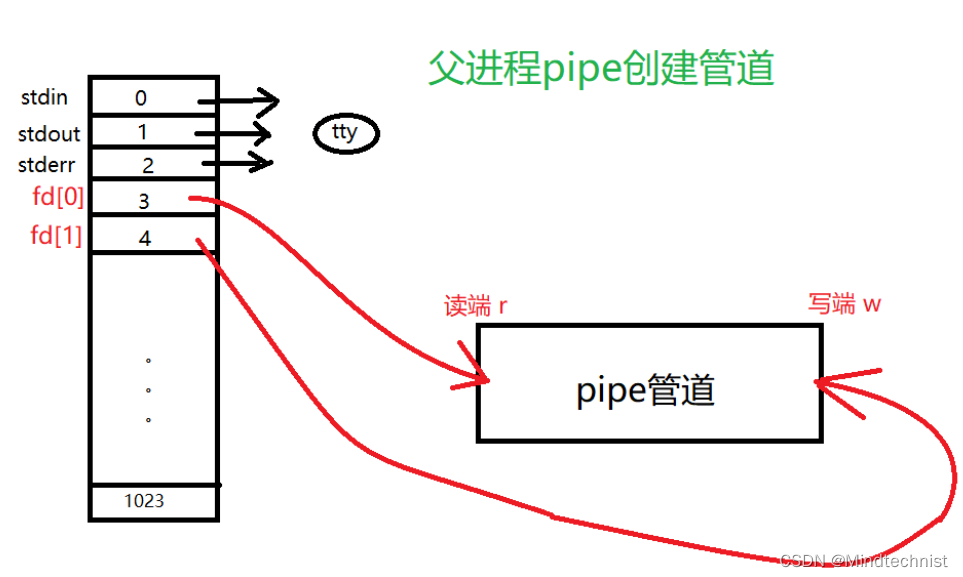
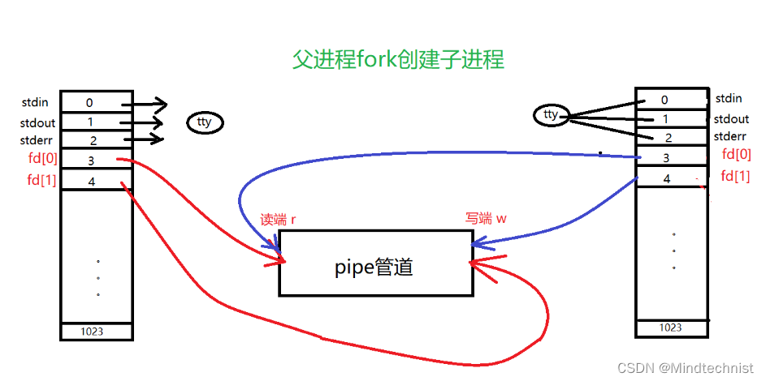
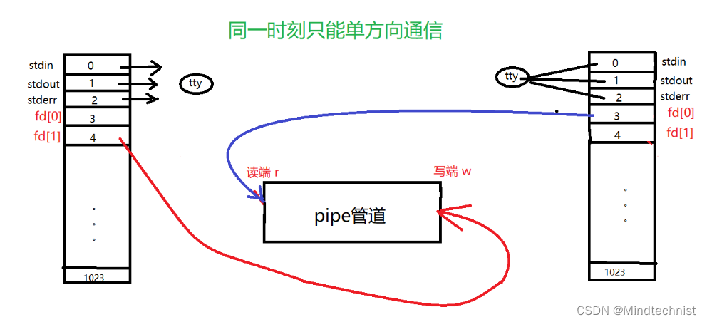

# 练习1: 完成读文件操作的实现

## 1. 实验要求

首先了解打开文件的处理流程，然后参考本实验后续的文件读写操作的过程分析，填写在 `kern/fs/sfs/sfs_inode.c` 中的 `sfs_io_nolock()` 函数，实现读文件中数据的代码。

## 2. 设计思路与实现

`sfs_io_nolock` 是 SFS 文件系统中进行文件读写操作的底层核心函数（不带锁）。由于文件数据在磁盘上是以块（Block，通常为 4096 字节）为单位存储的，而用户的读写请求可能从任意偏移量开始，长度也任意，因此需要分三种情况处理：

1.  **起始的不对齐部分**：如果读写的起始偏移量 `offset` 没有对齐到块边界，需要先处理第一块中从 `offset` 到块末尾（或结束位置）的数据。
2.  **中间的对齐块**：对于中间完整的块，可以直接以块为单位进行读写，效率更高。
3.  **末尾的不对齐部分**：如果结束位置 `endpos` 没有对齐到块边界，需要处理最后一块中从块开始到 `endpos` 的数据。

### 代码实现

在 `kern/fs/sfs/sfs_inode.c` 中，`sfs_io_nolock` 函数的实现如下：

```c
static int
sfs_io_nolock(struct sfs_fs *sfs, struct sfs_inode *sin, void *buf, off_t offset, size_t *alenp, bool write) {
    // ... (省略前面的变量定义和边界检查代码) ...

    int (*sfs_buf_op)(struct sfs_fs *sfs, void *buf, size_t len, uint32_t blkno, off_t offset);
    int (*sfs_block_op)(struct sfs_fs *sfs, void *buf, uint32_t blkno, uint32_t nblks);
    if (write) {
        sfs_buf_op = sfs_wbuf, sfs_block_op = sfs_wblock;
    }
    else {
        sfs_buf_op = sfs_rbuf, sfs_block_op = sfs_rblock;
    }

    int ret = 0;
    size_t size, alen = 0;
    uint32_t ino;
    uint32_t blkno = offset / SFS_BLKSIZE;          // The NO. of Rd/Wr begin block
    uint32_t nblks = endpos / SFS_BLKSIZE - blkno;  // The size of Rd/Wr blocks

    // LAB8:EXERCISE1 YOUR CODE
    
    /* 第一步：处理起始的不对齐部分 */
    if ((blkoff = offset % SFS_BLKSIZE) != 0) {
        // 计算第一块需要读写的大小
        size = (nblks != 0) ? (SFS_BLKSIZE - blkoff) : (endpos - offset);
        
        // 获取对应逻辑块号 blkno 的磁盘块号 ino
        if ((ret = sfs_bmap_load_nolock(sfs, sin, blkno, &ino)) != 0) {
            return ret;
        }
        // 读/写数据
        if ((ret = sfs_buf_op(sfs, buf, size, ino, blkoff)) != 0) {
            return ret;
        }
        
        // 更新已处理长度和缓冲区指针
        alen += size;
        buf += size;
        
        // 如果只在这一块内就结束了，直接跳转到 out
        if (nblks == 0) {
            goto out;
        }
        
        // 移动到下一块
        blkno++;
        nblks--;
    }

    /* 第二步：处理中间的对齐块 */
    while (nblks > 0) {
        // 获取磁盘块号
        if ((ret = sfs_bmap_load_nolock(sfs, sin, blkno, &ino)) != 0) {
            return ret;
        }
        // 读/写整个块
        if ((ret = sfs_block_op(sfs, buf, ino, 1)) != 0) {
            return ret;
        }
        
        // 更新变量
        alen += SFS_BLKSIZE;
        buf += SFS_BLKSIZE;
        blkno++;
        nblks--;
    }

    /* 第三步：处理末尾的不对齐部分 */
    if ((size = endpos % SFS_BLKSIZE) != 0) {
        // 获取磁盘块号
        if ((ret = sfs_bmap_load_nolock(sfs, sin, blkno, &ino)) != 0) {
            return ret;
        }
        // 读/写剩余数据
        if ((ret = sfs_buf_op(sfs, buf, size, ino, 0)) != 0) {
            return ret;
        }
        alen += size;
    }

out:
    *alenp = alen;
    if (offset + alen > sin->din->size) {
        sin->din->size = offset + alen;
        sin->dirty = 1;
    }
    return ret;
}
```

## 3. 关键函数分析

*   **`sfs_bmap_load_nolock`**: 这是文件系统索引的核心，它负责查找文件逻辑块对应的物理磁盘块。如果是写操作且块不存在，它还会负责分配新的磁盘块。
*   **`sfs_buf_op` (指向 `sfs_rbuf` 或 `sfs_wbuf`)**: 处理块内的部分读写，需要指定块内的偏移量。
*   **`sfs_block_op` (指向 `sfs_rblock` 或 `sfs_wblock`)**: 处理整块的读写，直接操作缓冲区。

# 练习2: 完成基于文件系统的执行程序机制的实现

## 1. 设计原理与函数介绍

在练习2中，我们需要实现基于文件系统的执行程序机制。这主要涉及到从磁盘加载 ELF 格式的程序文件到内存中，并建立用户进程的内存空间。核心函数是 `load_icode`。

### 核心函数：`load_icode`

`load_icode` 函数位于 `kern/process/proc.c` 中，其主要功能是加载执行程序。与 Lab5 中直接加载内存中的 ELF 不同，Lab8 需要通过文件系统接口读取磁盘上的文件。

主要流程如下：
1.  **建立内存管理器**：调用 `mm_create` 创建新的 `mm_struct`，并调用 `setup_pgdir` 创建页目录表。
2.  **读取 ELF 头**：使用 `load_icode_read`（底层调用 `sysfile_read` 或 `file_read`）从文件描述符 `fd` 中读取 ELF Header。
3.  **解析程序头表 (Program Headers)**：
    *   遍历 ELF 的程序头表。
    *   对于类型为 `ELF_PT_LOAD` 的段，调用 `mm_map` 建立虚拟地址空间的映射（VMA）。
    *   根据段的 `p_filesz`（文件大小）和 `p_memsz`（内存大小），分配物理页 (`pgdir_alloc_page`)。
    *   将文件中的内容读取到分配的物理页中。
    *   处理 BSS 段：如果 `p_memsz > p_filesz`，说明存在未初始化的数据（BSS），需要将多出的内存空间清零。
4.  **建立用户栈**：
    *   调用 `mm_map` 映射用户栈空间 (`USTACKTOP - USTACKSIZE` 到 `USTACKTOP`)。
    *   分配物理页以支持栈的使用。
5.  **处理用户参数 (argc, argv)**：
    *   将传入的参数字符串拷贝到用户栈的顶部。
    *   在栈上构建 `argv` 指针数组，指向这些字符串。
    *   设置 `argc`。
    *   确保栈指针 `sp` 对齐。
6.  **设置 Trapframe**：
    *   修改当前进程的中断帧 `tf`。
    *   `tf->epc` 设置为 ELF 的入口点 (`e_entry`)。
    *   `tf->gpr.sp` 设置为用户栈顶。
    *   `tf->status` 设置为用户态 (`SSTATUS_SPIE` 等)。
    *   `tf->gpr.a0` 设置为 `argc`，`tf->gpr.a1` 设置为 `argv` 的地址（根据 RISC-V 调用约定）。

### 其他相关修改

为了支持文件系统，进程控制块 (`proc_struct`) 增加了 `filesp` 成员，用于管理打开的文件。
*   **`alloc_proc`**: 初始化 `proc->filesp = NULL`。
*   **`do_fork`**: 在进程复制时，调用 `copy_files` 复制父进程的文件描述符表（增加引用计数）。
*   **`do_exit`**: 在进程退出时，调用 `put_files` 释放文件描述符表。

## 2. 代码实现解释 (TODO 内容)

在 `kern/process/proc.c` 中，我们主要完成了以下工作：

### 2.1 `alloc_proc` 初始化
```c
// lab8 add:
proc->filesp = NULL; // 初始化文件结构指针为空
```
这是为了防止未初始化的指针导致后续操作错误。

### 2.2 `do_fork` 复制文件系统信息
```c
if (copy_files(clone_flags, proc) != 0) { // 复制文件描述符表
    goto bad_fork_cleanup_kstack;
}
```
当创建一个新进程时，子进程需要继承父进程打开的文件。`copy_files` 会根据 `clone_flags` 决定是共享还是复制文件表。

### 2.3 `load_icode` 加载 ELF
这是本练习最核心的部分。代码逻辑如下：

1.  **创建内存环境**：
    ```c
    if ((mm = mm_create()) == NULL) { goto bad_mm; }
    if (setup_pgdir(mm) != 0) { goto bad_pgdir_cleanup_mm; }
    ```

2.  **读取并校验 ELF 头**：
    ```c
    // 使用 load_icode_read 从 fd 读取 ELF 头
    if ((ret = load_icode_read(fd, elf, sizeof(struct elfhdr), 0)) != 0) { ... }
    if (elf->e_magic != ELF_MAGIC) { ... }
    ```

3.  **加载程序段**：
    ```c
    for (int i = 0; i < elf->e_phnum; i++) {
        // 读取程序头
        load_icode_read(fd, ph, sizeof(struct proghdr), phoff);
        if (ph->p_type != ELF_PT_LOAD) continue;
        
        // 设置权限并建立映射
        mm_map(mm, ph->p_va, ph->p_memsz, vm_flags, NULL);
        
        // 分配物理页并读取文件内容
        while (start < end) {
            page = pgdir_alloc_page(mm->pgdir, la, perm);
            load_icode_read(fd, page2kva(page) + off, size, offset);
            // ... 更新 start, offset 等
        }
        // 处理 BSS 段（清零）
        // ... memset(page2kva(page) + off, 0, size);
    }
    ```

4.  **设置用户栈和参数**：
    ```c
    // 映射栈空间
    mm_map(mm, USTACKTOP - USTACKSIZE, USTACKSIZE, vm_flags, NULL);
    // 分配栈的物理页
    pgdir_alloc_page(mm->pgdir, USTACKTOP-PGSIZE , PTE_USER);
    // ...
    
    // 将参数压栈 (kargv -> user stack)
    // 计算参数长度，拷贝字符串，设置 argv 数组
    // ...
    ```

5.  **设置 Trapframe**：
    ```c
    tf->gpr.sp = sp;             // 设置栈指针
    tf->epc = elf->e_entry;      // 设置入口地址
    tf->gpr.a0 = argc;           // 参数 argc
    tf->gpr.a1 = argv_ptr;       // 参数 argv
    ```

## 3. 实验步骤与截图复现

为了复现 `/home/root2/labcodes/OS/images/` 目录下的 `lab8-1` 到 `lab8-3` （分别对应启动、运行程序、退出场景），需要执行以下步骤：

### 步骤 1: 编译并运行内核 
在终端中执行：
```bash
make qemu
```
**预期结果**：
系统启动，输出内核初始化信息，最终显示 `user sh is running!!!`，并进入 Shell 交互界面（`$` 提示符）。这证明文件系统初始化成功，且 `sh` 程序被正确加载。


### 步骤 2: 运行用户程序 hello 
在 Shell 提示符下输入：
```bash
$ hello
```
**预期结果**：
Shell 加载并运行 `hello` 程序，屏幕输出：
```
Hello world!!
```
这证明 `load_icode` 能够正确解析并加载其他 ELF 文件，且 `sfs_io_nolock` 读文件功能正常。


### 步骤 3: 运行 exit 
在 Shell 提示符下输入：
```bash
$ exit
```
**预期结果**：
*   `exit`：Shell 可能会提示退出或重启。


## 实验结果

make grade 测试结果如下：



# 扩展练习 Challenge1：完成基于“UNIX的PIPE机制”的设计方案
## 实验要求
如果要在ucore里加入UNIX的管道（Pipe）机制，至少需要定义哪些数据结构和接口？（接口给出语义即可，不必具体实现。数据结构的设计应当给出一个（或多个）具体的C语言struct定义。在网络上查找相关的Linux资料和实现，请在实验报告中给出设计实现”UNIX的PIPE机制“的概要设方案，你的设计应当体现出对可能出现的同步互斥问题的处理。）

## 设计方案
参考资料：
1. 【Linux进程间通信】二、pipe管道 https://www.cnblogs.com/mindtechnist/p/17243750.html
2.  AI
### 数据结构设计
- 管道缓冲区控制块
```c
#define PIPE_BUF_SIZE 4096  // 管道默认缓冲区大小

typedef struct pipe_buf {
    char data[PIPE_BUF_SIZE]; // 环形缓冲区
    int head;                 // 下一个读位置
    int tail;                 // 下一个写位置
    int cnt;                  // 当前缓冲区字节数
} pipe_buf_t;
```
- 管道对象结构
```c
typedef struct pipe {
    pipe_buf_t buf;        // 管道缓冲区控制块

    int ref_read;          // 读端引用计数
    int ref_write;         // 写端引用计数

    // 同步互斥对象
    spinlock_t lock;       // 保护管道状态的自旋锁
    wait_queue_t wait_read;  // 读等待队列
    wait_queue_t wait_write; // 写等待队列

    bool closed_read;      // 读端是否已关闭
    bool closed_write;     // 写端是否已关闭
} pipe_t;
```
- 管道文件描述符封装
```c
typedef struct file {
    file_ops_t *f_ops;  // 指向对应的读/写操作接口
    pipe_t *pipe;       // 指向管道对象
    int mode;           // FMODE_READ 或 FMODE_WRITE
} pipe_file_t;
```

### 接口设计
- 创建管道
```c
int pipe_create(int pipefd[2]);
```
创建一个新的 pipe_t 管道对象

- 管道读操作
```c
ssize_t pipe_read(pipe_t *p, char *buf, size_t count);
```
从管道 p 中读取最多 count 字节到用户缓冲区 buf

- 管道写操作
```c
ssize_t pipe_write(pipe_t *p, const char *buf, size_t count);
```
将最多 count 字节写入管道 p，

- 管道关闭（读/写端分开）
```c
int pipe_close_read(pipe_t *p);
int pipe_close_write(pipe_t *p);
```
在文件描述符关闭时减少对应引用计数

### 同步互斥问题
1.互斥访问缓冲区
- 采用 自旋锁（spinlock） 对管道控制块加锁，保护对 head／tail／count／队列的修改。

2.阻塞与唤醒机制
- 使用内核等待队列实现阻塞与唤醒操作。当缓冲空时读阻塞；缓冲满时写阻塞。
- 其他端写入或读取数据后应唤醒相应等待队列。

3.引用计数避免早释放
- 当读写端引用计数 >0 时，保持管道实例。一旦所有引用消失才释放。

### 工作原理
1.父进程调用pipe()函数创建管道，并得到指向管道读端和写端的文件描述符fd[0]和fd[1]。创建出来的管道实际上是内核的一块缓冲区，我们可以像读写文件一样来操作这个缓冲区，所以也可以把他理解为一个伪文件。



2.父进程调用fork()创建子进程，子进程将共享这两个指向管道读写端的文件描述符。



3.如果父进程关闭管道读端，子进程关闭管道写端，此时父进程可以向管道中写入数据，子进程将管道中的数据读出，反之同理。由于管道是利用环形队列实现的，数据从写端流入管道，从读端流出，这样就实现了进程间通信。



